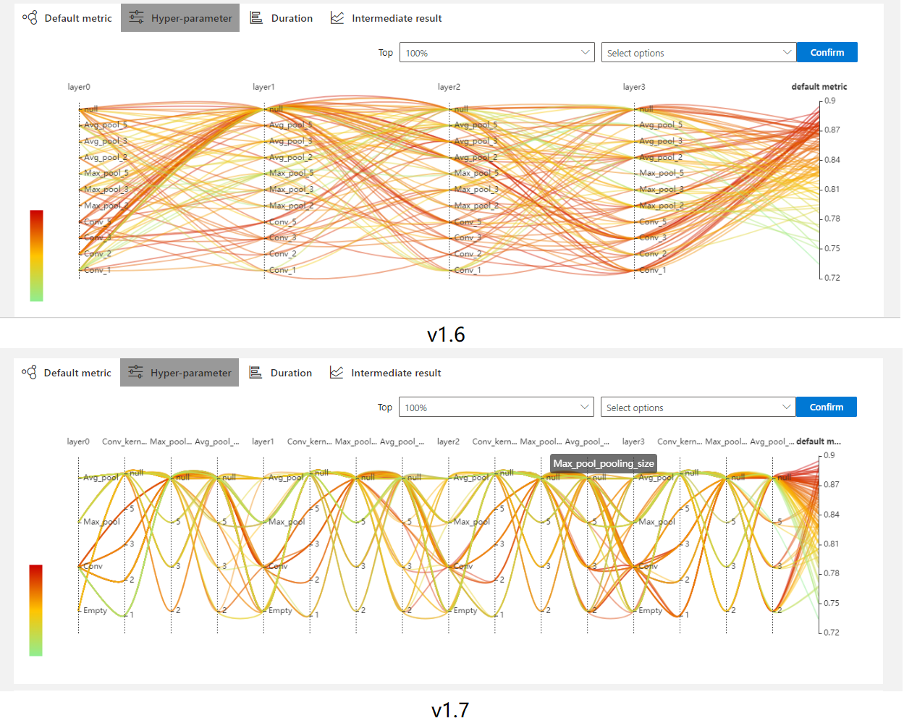
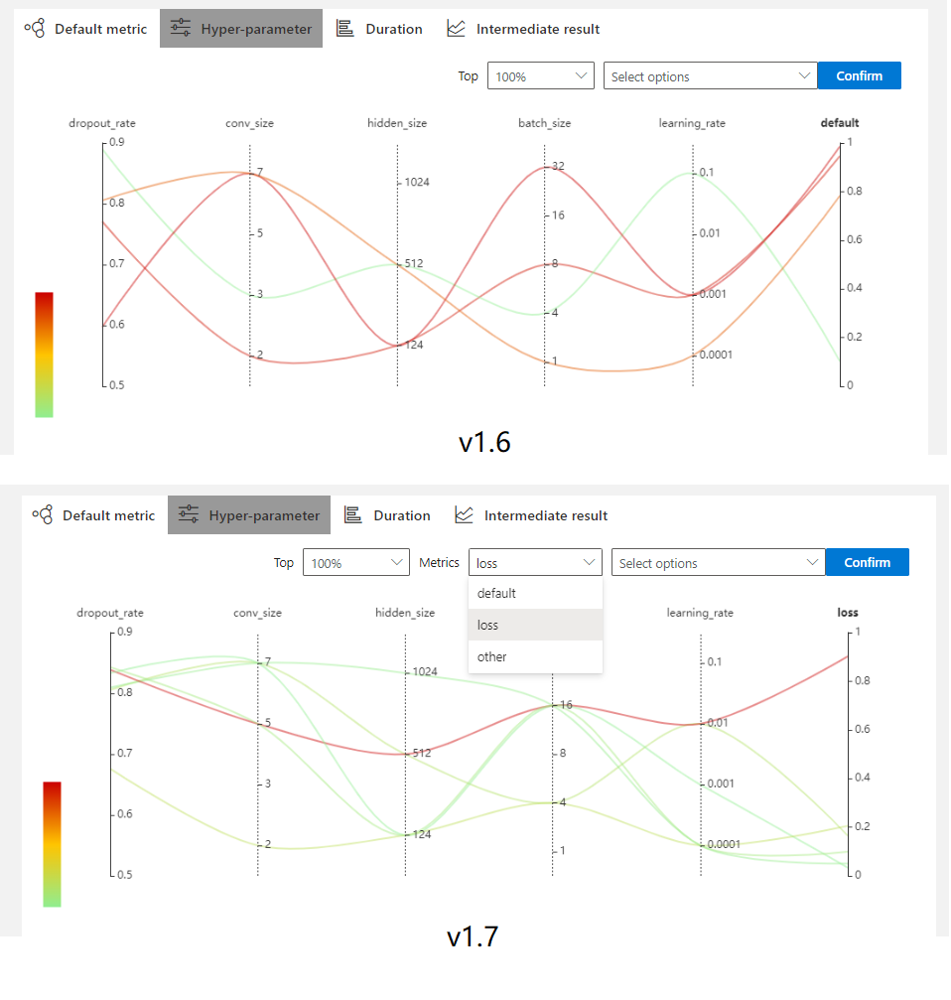

# NNI v1.7 正式发布，多项重大特性速览
# 概述
NNI 是由微软亚洲研究院研发的一款自动机器学习开源项目，目前已经在github上获得了超过6,400个stars（项目地址：https://github.com/microsoft/nni）。NNI提供了对机器学习生命周期的全方位支持，通过使用NNI，用户可以将特征工程、神经网络架构搜索（NAS）、超参调优以及模型压缩等过程自动化，从而节省时间、提高模型效果。

NNI v1.7是NNI团队于2020年7月8日发布的最新版本，带来了训练平台、模型压缩、神经网络架构搜索以及Web界面优化等方面的一系列重大更新。
# What's new？
## 训练平台
### 支持Azure Machine Learning作为训练平台
[Azure Machine Learning (AML)](https://azure.microsoft.com/zh-cn/services/machine-learning/)是由Microsoft推出的企业级机器学习服务，可用于快速构建和部署模型。NNI v1.7将在训练平台中加入了对AML模式的支持，只需要一个Azure订阅和相应的计算资源，用户便可将自己的模型和代码部署到云端进行实验，同时在本地查看实验结果，从而能够克服本地计算资源不能满足实验要求的限制。AML模式使用Docker来配置运行环境，这使得用户不再需要耗费精力去解决令人头疼的环境问题，而只需要专注于算法的设计与实现，然后指定Docker镜像即可顺利运行。在其他方面，AML保持了与其他训练平台的一致性，除了需要对一个配置文件进行些许修改之外，不需要任何其他的额外操作，从而降低了用户的学习成本。AML模式的详细教程请参见[这里](https://github.com/microsoft/nni/blob/v1.7/docs/en_US/TrainingService/AMLMode.md)。

以nni的[官方mnist样例](https://github.com/microsoft/nni/tree/v1.7/examples/trials/mnist-tfv1)为例，只需要修改`config_aml.yml`文件:
```
authorName: default
experimentName: example_mnist
trialConcurrency: 1
maxExecDuration: 1h
maxTrialNum: 10
trainingServicePlatform: aml
searchSpacePath: search_space.json
#choice: true, false
useAnnotation: false
tuner:
  #choice: TPE, Random, Anneal, Evolution, BatchTuner, MetisTuner, GPTuner
  #SMAC (SMAC should be installed through nnictl)
  builtinTunerName: TPE
  classArgs:
    #choice: maximize, minimize
    optimize_mode: maximize
trial:
  command: python3 mnist.py
  codeDir: .
  computeTarget: ${replace_to_your_computeTarget}
  image: msranni/nni
amlConfig:
  subscriptionId: ${replace_to_your_subscriptionId}
  resourceGroup: ${replace_to_your_resourceGroup}
  workspaceName: ${replace_to_your_workspaceName}
```
其中`trainingServicePlatform`指定为aml模式，`computeTarget`指定为选择的计算资源的名称（Azure中计算集群的名称），再指定amlConfig中的`subscriptionId`，`resourceGroup`和`workspaceName`为Azure中对应的值即可。其他部分的配置与本地训练模式无异。

然后，使用`nnictl create --config config_aml.yml`即可启动实验，WebUI的地址与本地模式的地址相同。
### OpenPAI job支持复用
NNI v1.7中，当用户选择OpenPAI作为训练平台时，可以通过在配置文件中指定`reuse`这一关键字的值来选择是否要在同一个job中运行多个trial：
```
paiConfig:
  userName: your_pai_nni_user
  token: your_pai_token
  host: 10.1.1.1
  # optional, experimental feature.
  reuse: true
```
若用户在配置文件的`paiConfig`这一项中将`reuse`设置为true（默认为false），则当一个trial完成时，对应的OpenPAI job不会停止，而是会等待下一个trial来继续运行，这一特性可以节省创建新的OpenPAI job所花费的时间。需要注意的是，当用户使用这一功能时，需要确保同一个job中的每个trial是相互独立的，例如需要避免从之前运行过的trial中加载检查点等操作。该特性的详细说明可以参见[这里](https://github.com/microsoft/nni/blob/v1.7/docs/en_US/TrainingService/PaiMode.md#openpai-configurations)。
### 支持在向训练平台上传代码时使用`.nniignore`忽略某些目录和文件
在你使用git时也许遇到过这样的问题：总是不小心把某些不需要的文件，例如python运行产生的缓存目录`__pycache__`和代码运行生成的非常大的模型文件等等，上传到了git仓库中。对此，git提供了`.gitignore`文件作为解决方案，通过配置该文件，用户得以有选择地将文件添加到仓库中。在使用非本机训练平台时，由于需要将代码目录上传至远端的训练平台，NNI用户可能面临同样的问题（NNI对上传的文件数和文件的总大小做了限制，分别是最多2000个文件和最大300MB）。为此，在NNI v1.7中，用户可以设置类似的`.nniignore`文件来选择哪些文件需要进行上传，该文件的行为与`.gitignore`类似。该特性的详细说明可以参见[这里](https://github.com/microsoft/nni/blob/v1.7/docs/en_US/TrainingService/Overview.md#how-to-use-training-service)。

## 神经网络架构搜索（NAS）
### 支持NAS Benchmark 查询功能
为了提高NAS算法的可复现性，同时降低对计算资源的需求，研究者们提出了一系列NAS基准测试，例如[NAS-Bench-101](https://arxiv.org/abs/1902.09635), [NAS-Bench-201](https://arxiv.org/abs/2001.00326)以及[NDS](https://arxiv.org/abs/1905.13214)等等。通过应用这些基准测试，研究者们可以公平且方便地评估他们的NAS算法。NNI v1.7提供了一个简便的查询接口用于获取主流的NAS基准测试，仅需几行代码，研究者们就可以通过这些基准测试来公平且方便地评估他们的NAS算法，而不需要去从头训练搜索到的模型。

首先，用户需要下载并处理这些基准测试数据集，具体方法参见[这里](https://github.com/microsoft/nni/blob/v1.7/docs/en_US/NAS/Benchmarks.md)。在数据集处理完成之后即可使用。

以NAS-Bench-101数据集为例，用户只需要调用
```
arch = {
    'op1': 'conv3x3-bn-relu',
    'op2': 'maxpool3x3',
    'op3': 'conv3x3-bn-relu',
    'op4': 'conv3x3-bn-relu',
    'op5': 'conv1x1-bn-relu',
    'input1': [0],
    'input2': [1],
    'input3': [2],
    'input4': [0],
    'input5': [0, 3, 4],
    'input6': [2, 5]
}
for t in query_nb101_trial_stats(arch, 108):
    pprint.pprint(t)
```
就可以输出网络结构`arch`在NAS-Bench-101数据集中训练108个epoch所能得到的效果，其中`t`为一个字典，包含了模型结构、网络的哈希值、epoch数、训练集准确率、测试集准确率以及训练时间等一系列信息：
```
{'config': {'arch': {'input1': [0],
                     'input2': [1],
                     'input3': [2],
                     'input4': [0],
                     'input5': [0, 3, 4],
                     'input6': [2, 5],
                     'op1': 'conv3x3-bn-relu',
                     'op2': 'maxpool3x3',
                     'op3': 'conv3x3-bn-relu',
                     'op4': 'conv3x3-bn-relu',
                     'op5': 'conv1x1-bn-relu'},
            'hash': '00005c142e6f48ac74fdcf73e3439874',
            'id': 4,
            'num_epochs': 108,
            'num_vertices': 7},
 'id': 10,
 'parameters': 8.55553,
 'test_acc': 92.11738705635071,
 'train_acc': 100.0,
 'training_time': 106147.67578125,
 'valid_acc': 92.41786599159241}
```
对以上代码详细信息的介绍，可以参见NAS Benchmarks的[完整示例](https://github.com/microsoft/nni/blob/v1.7/docs/en_US/NAS/BenchmarksExample.ipynb)。

### Classic NAS支持Tensorflow 2.X
Classic NAS（即不采用权重衰减的NAS，每种网络架构都从头开始训练）目前仍然是NAS算法中一个非常重要的方向，最近ICLR'20的投稿中对于是否使用权重共享也有很多不同的声音。NNI v1.7中添加了对Tensorflow 2.X版本的Classic NAS支持。在NNI中，Classic NAS的使用方式非常类似于超参调优，只不过每次从Tuner获取的不是一组超参而是一个网络架构。关于如何在NNI中使用Classic NAS请参见[这里](https://github.com/microsoft/nni/blob/v1.7/docs/en_US/NAS/ClassicNas.md)，关于使用Tensorflow 2.X来进行Classic NAS请参见[此示例](https://github.com/microsoft/nni/tree/master/examples/nas/classic_nas-tf)。
## 模型压缩
### 支持对Resnet/Squeezenet/Mobilenet进行模型加速
NNI v1.7的模型压缩模块添加了对concat、add以及grouped convolution等操作的支持，从而使得用户可以将模型加速算法应用到Resnet、Squeezenet和Mobilenet等模型之上。关于如何在NNI中使用模型压缩的介绍详见[这里](https://github.com/microsoft/nni/blob/master/docs/en_US/Compressor/Overview.md)。
### 提供敏感性分析工具和拓扑分析工具
NNI v1.7提供了两个新的实用工具。第一个为敏感性分析工具，用户可以通过该工具来分析模型中每一层的剪枝比率对模型效果产生的影响，分析结果可以被可视化出来供用户做出决策。第二个为拓扑分析工具，该工具可以自动分析模型每一层之间存在的输入输出形状的依赖关系，同时自动修复这些层之间因为依赖关系产生的冲突，从而使得NNI的模型压缩功能能够处理带有残差连接的模型。这两个工具的详细介绍及使用方式请参见此[文档](https://github.com/microsoft/nni/blob/v1.7/docs/en_US/Compressor/CompressionUtils.md)。
### 增加新的剪枝算法
NNI v1.7提供了更多剪枝算法的NNI实现，包括[NetAdapt Pruner](https://github.com/microsoft/nni/blob/v1.7/docs/en_US/Compressor/Pruner.md#netadapt-pruner)，[SimulatedAnnealing Pruner](https://github.com/microsoft/nni/blob/v1.7/docs/en_US/Compressor/Pruner.md#simulatedannealing-pruner)，[AutoCompress Pruner](https://github.com/microsoft/nni/blob/v1.7/docs/en_US/Compressor/Pruner.md#autocompress-pruner)，以及[ADMM Pruner](https://github.com/microsoft/nni/blob/v1.7/docs/en_US/Compressor/Pruner.md#admm-pruner)等等。
### 简便的FLOPs计算工具
FLOPs是一个衡量模型/算法复杂度的重要指标。NNI v1.7提供了一个简便的FLOPs计算工具来帮助用户检查模型的复杂度。只需要仅仅几行代码：
```
from nni.compression.torch.utils.counter import count_flops_params

# Given input size (1, 1, 28, 28) 
flops, params = count_flops_params(model, (1, 1, 28, 28))
# Format output size to M (i.e., 10^6)
print(f'FLOPs: {flops/1e6:.3f}M,  Params: {params/1e6:.3f}M)
```
用户就可以得到与模型输入的大小对应的FLOPs。该计算工具支持对模型压缩和NAS计算FLOPs，详细介绍请参考[这里](https://github.com/microsoft/nni/blob/v1.7/docs/en_US/Compressor/CompressionUtils.md#model-flopsparameters-counter)。
### Lottery ticket算法支持导出winning ticket
NNI v1.7支持从Lottery ticket pruner中导出winning ticket，详见此[示例](https://github.com/chicm-ms/nni/blob/9ff69db145ddcadc929f2ce012ab7c7103d522dd/examples/model_compress/lottery_torch_mnist_fc.py)。
## Web界面
v1.7版本还对NNI的Web界面进行了优化，具体包括：
1) 在NNI v1.6及之前的版本，每个trial的耗时在WebUI中是以秒数来表示的，在新版本中采用了更为直观的时-分-秒格式。
2) 修复了`Duration`和`Intermediate result`选项卡在不会随Auto refresh自动刷新的问题。
3) 对嵌套搜索空间的支持更加友好。在新版本中当搜索空间当中包含了嵌套关系时，该嵌套搜索空间中的每个参数都可以作为一个独立的轴来进行展示。下面的图片对比了旧版本和新版本之间的不同：

4) 支持选择展示不同的metrics。当实验的每个trial报告给nni的metric是字典而不是默认的数值时，用户可以在WebUI中自由选择希望展示的metric：

5) 修复了detail界面的metric style。
## 其他更新
### 支持安装用户自定义Tuner/Advisor/Assessor
从v1.7版本开始，用户将可以把自己编写的算法安装为NNI的内置Tuner/Advisor/Assessor，具体的使用方式可以参见[这里](https://nni.readthedocs.io/en/latest/Tutorial/InstallCustomizedAlgos.html)。通过将自己的Tuner注册为NNI的内置Tuner，用户可以以与使用内置Tuner相同的方式使用算法，更为重要的是，这使得这些算法在不同用户之间的分享和传播变得更加容易。用户可以通过`nnictl package list`命令来查看当前安装了哪些算法。

### 增加合并参数工具
通常情况下，在进行超参调优时，训练代码通过`nni.get_next_parameters()`来获取Tuner给出的一组超参数组合，但是在某些情况下，用户可能会通过命令行等方式传入一些初始参数，此时可能会希望从Tuner获得的参数能够将这些初始参数覆盖掉。v1.7中提供了`nni.utils.merge_parameter()`来实现这一功能，该函数能够自动将初始参数与从Tuner中获得的参数进行合并。详见[这里](https://github.com/microsoft/nni/blob/v1.7/src/sdk/pynni/nni/utils.py)。

### 增加更多代码示例
除了上文中提到的Tensorflow 2.X Classic NAS代码示例外，本次更新还添加了演示如何对操作符进行调优的OpEvo示例，详见[这里](https://github.com/microsoft/nni/blob/v1.7/docs/en_US/TrialExample/OpEvoExamples.md)。

### 支持在PAI模式下设置`paiStorageConfigName`
为了提供对Azure Blob Storage的支持，NNI v1.7在配置文件中新增了`paiStorageConfigName`这一关键字。通过这一选项，用户在选择OpenPAI作为训练平台时，可以指定Azure Blob和NFS等数据存储方式。详细的使用说明请参见[这里](https://github.com/SparkSnail/nni/blob/687fe5f0eb355a9d61885a1a04e751165b30e7cd/docs/en_US/TrainingService/PaiMode.md#data-management)。

### 文档更新
更新了模型压缩、NAS基准测试以及AML模式的相关文档，并将项目主页迁移至readthedocs。
### Bug修复
修复了nodejs OOM，Web界面style issues等一些bug，详见v1.7的[发布说明](https://github.com/microsoft/nni/releases/tag/v1.7)。
# 总结
NNI v1.7在训练平台、模型压缩、NAS、Web界面等方面进行了一系列更新，特别是对Azure ML的支持使得用户的学习成本降低，从而能够更加专注于对算法和模型等核心内容。作为一个开源项目，我们期待用户为 NNI 添加新算法、功能、示例，提出建议、报告问题。如果您有任何反馈与建议，欢迎在 GitHub 社区中告知我们。

NNI 的 GitHub 社区：https://aka.ms/nniis

NNI 的 GitHub 主页：https://github.com/microsoft/nni

NNI v1.7 Release Introdcution: https://github.com/microsoft/nni/releases/tag/v1.7
