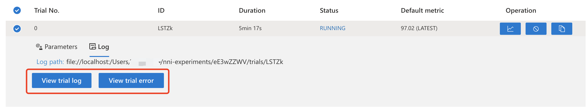

# NNI v1.8 正式发布，多项重大特性速览
# 概述
NNI 是由微软亚洲研究院研发的一款自动机器学习开源项目，目前已经在github上获得了超过6,800个 stars（项目地址：https://github.com/microsoft/nni)。NNI 提供了对机器学习生命周期的全方位支持，通过使用 NNI，用户可以将特征工程、神经网络架构搜索（NAS）、超参调优以及模型压缩等过程自动化，从而节省时间、提高模型效果。

NNI v1.8是 NNI 团队于2020年8月27日发布的最新版本，带来了训练平台、模型压缩、神经网络架构搜索、Web 界面以及命令行工具等方面的一系列重大更新。
# What's new？
## 训练平台

* 支持在 Web 界面直接打开 Trial 日志（本地模式）或显示日志链接（OpenPAI / AML 模式）
发现自己的 Trial 没有运行成功往往令人沮丧。在以往的 NNI 版本中，如果想要查看 Trial 运行失败的原因，需要根据 Web 界面提供的日志路径去找对应的日志文件，这使得用户需要频繁在 Web 界面和日志目录之间切换，带来了一定程度的不便。NNI v1.8 首次支持在 Web 界面打开每个 Trial 对应的日志（在新窗口中显示），这使得用户能够快速定位训练代码中的问题并进行修改，从而提高了用户的使用效率。目前此功能仅支持本地模式，对于以 OpenPAI 或 AML 为训练平台的用户，Web 界面中每个 Trial 下将显示日志对应的 url，将该 url 复制到浏览器并打开即可查看对应日志信息，如下图所示。

* 支持在 reuse 模式下使用 GPU

通过使用 [reuse](https://nni.readthedocs.io/en/latest/Tutorial/ExperimentConfig.html#reuse) 模式，用户可以在同一个 OpenPAI / AML job 中尽可能多地运行 Trials，这可以节省创建新 job 所需的时间。NNI v1.8 首次支持在 reuse 模式中使用 GPU。

## Web 界面

NNI v1.8 改进了 Hyper-parameter 界面，使得其能够更好地支持嵌套搜索空间，并允许用户通过拖动每一个超参数的轴来改变这些轴的位置从而更直观地分析每个超参数对模型性能的影响。此外，还添加了对 Trial Job 列表进行分页等一些小的改动。

## nnictl 与 nnicli

* nnitl
nnictl 是 NNI 的命令行工具，提供了一系列命令用于控制 NNI 实验。NNI v1.8 新增了用于保存和加载实验的命令 `nnictl experiment save` 和 `nnictl experiment load` 。通过`nnictl experiment save`，用户可以将自己的 NNI 实验打包为一个压缩包，之后用户可以在其他机器上通过 `nnictl experiment load` 来加载该实验，从而实现了同一个 NNI 实验在不同机器之间的共享。NNI v1.8 还对 nnictl 中的其他命令进行了改进，例如现在 `nnictl experiment export` 命令可以通过添加参数 `--intermediate` 来同时导出每个 Trial 的中间结果，以及在 `nnictl trial ls` 命令中可以通过指定 `--head` 或 `--tail` 来列出性能最好或最差的那些 Trial。
* nnicli
NNI client (nnicli) 是 nnictl 的 python API，它为大多数常用的 nnictl 命令提供了 python 接口。NNI v1.8 对 nnicli 进行了重构，对每个 NNI 实验通过一个 `Experiment` 实例来进行管理。通过 nnicli，用户可以直接通过 python 代码来控制他们的实验，收集实验结果并对实验结果进行进一步的分析。详细的使用方法请参见[文档](https://nni.readthedocs.io/en/latest/nnicli_ref.html)和[示例](https://github.com/microsoft/nni/blob/master/examples/notebooks/retrieve_nni_info_with_python.ipynb)。

## 神经网络架构搜索（NAS）

* 添加 Darts 和 ENAS 的搜索空间集合（Search Space Zoo）
  NNI v1.8 中将 Darts 和 ENAS 的原始论文中所描述的搜索空间实现为一个 pytorch 模型，用户可以使用该模型和 NNI 自带的 `DartsTrainer` `ENASTrainer` 来在该搜索空间中搜索最优模型。详细的示例请参见[此文档](https://nni.readthedocs.io/en/latest/NAS/SearchSpaceZoo.html)。

* NAS benchmark 支持查询中间结果

  现在 NAS benchmark 支持查询中间结果。例如，在使用 `query_nb101_trial_stats` 查询 NAS-Bench-101 中的某个网络结构在 108 个 epoch 的性能时，若将 `include_intermediates` 设置为 `True`，则返回的结果中也会同时包含该网络结构在 54 个epoch的性能。详细的文档参见[这里](https://nni.readthedocs.io/en/latest/NAS/Benchmarks.html)。

## 模型压缩
* 提供对 tensorflow 2.x 的支持

NNI v1.8 首次支持对使用 tensorflow 2.x 编写的模型进行模型压缩。模型压缩的详细教程请参见[这里](https://nni.readthedocs.io/en/latest/model_compression.html)。

* 新的剪枝器

NNI v1.8 新增了 [Sensitivity pruner](https://github.com/microsoft/nni/blob/v1.8/docs/en_US/Compressor/Pruner.md#sensitivity-pruner) 和 [AMC pruner](https://github.com/microsoft/nni/blob/v1.8/docs/en_US/Compressor/Pruner.md) 两种剪枝器，欢迎用户试用并反馈问题。

* 新增对某些 operation 的支持

NNI v1.8 新增了对 List/Tuple Construct/Unpack 等 operation 的支持，同时提供了对 DenseNet 和 InceptionV3 模型的模型加速支持。

## 与旧版本不兼容的更新

* 存放实验的默认目录从 `$HOME/nni/experiments` 更改为 `$HOME/nni-experiments`

为了方便用户区分实验存放的目录和通过 `git clone` 获取的 NNI 源码目录，NNI v1.8 中将默认的实验存放目录更改至 `$HOME/nni-experiments`。若用户希望查看由旧版本 NNI 创建的实验，可将 `$HOME/nni/experiments` 的实验目录迁移至 `$HOME/nni-experiments`。

* 支持 Python 3.8，不再支持 Python 3.5 及 scikit-learn 0.20

NNI v1.8 为首个支持 Python 3.8 的 NNI 版本。同时出于兼容性考虑，不再支持 Python 3.5 及 scikit-learn。

## 文档更新与 Bug 修复

NNI v1.8 对部分文档进行了更新并修复了某些之前版本的 Bug，详见[发布说明](https://github.com/microsoft/nni/releases/tag/v1.8)。
# 总结
NNI v1.8 在训练平台、模型压缩、神经网络架构搜索、Web 界面以及命令行工具等方面进行了一系列更新。作为一个开源项目，我们期待用户为 NNI 添加新算法、功能、示例，提出建议、报告问题。如果您有任何反馈与建议，欢迎在 GitHub 社区中告知我们。

NNI 的 GitHub 社区：https://aka.ms/nniis

NNI 的 GitHub 主页：https://github.com/microsoft/nni

NNI v1.8 Release Introdcution: https://github.com/microsoft/nni/releases/tag/v1.8
